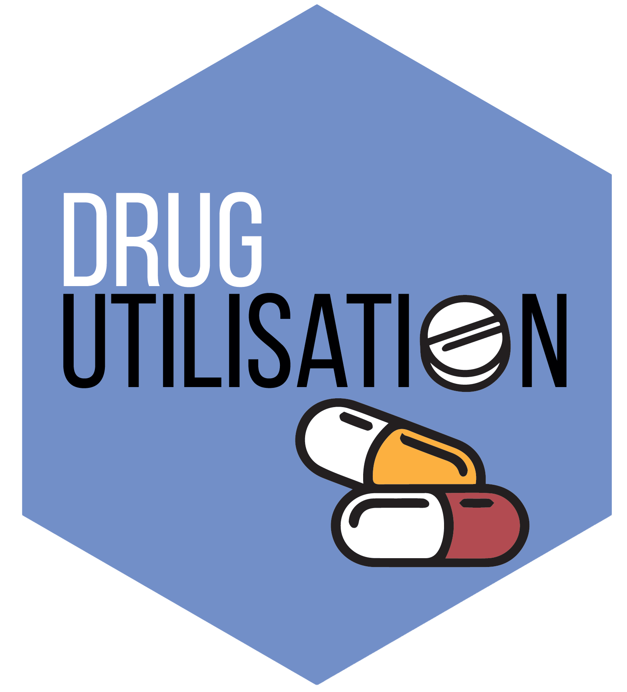

<!-- README.md is generated from README.Rmd. Please edit that file -->

```{r, include = FALSE}
knitr::opts_chunk$set(
  collapse = TRUE,
  comment = "#>",
  fig.path = "man/figures/README-",
  out.width = "100%"
)
```

# DrugUtilisation 

[](https://CRAN.R-project.org/package=DrugUtilisation) 
[](https://app.codecov.io/github/darwin-eu/DrugUtilisation?branch=main)
[](https://github.com/darwin-eu/DrugUtilisation/actions)
[](https://lifecycle.r-lib.org/articles/stages.html)

## WARNING: This package is under development.

* **addDailyDose** function works for the following patterns in the drug_strength table:

```{r, echo = FALSE}
DrugUtilisation::patternsWithFormula |>
  dplyr::mutate("formula" = paste0(.data$formula_name, ": ", .data$formula)) |>
  dplyr::select(-"formula_name", -"pattern_id") |>
  visOmopResults::gtTable(groupNameCol = "formula")
```

## Package overview

DrugUtilisation contains functions to instantiate and characterize the cohorts used in a Drug Utilisation Study in the OMOP common data model. Main functionalities are:

- Create DrugUtilisation cohorts

- Add indications to this cohort

- Add the dosage of a certain ingredient (subseted for a list of drugs)

- Calculate the daily dose

- Create Concept based cohorts 

- Read concepts from json files

- Summarise the drug use in a certain cohort

- Summarise the indications in a certain cohort

- Summarise the patients characteristics in a certain cohort

- Summarise the patients large scale characterics in a certain cohort

## Example

First, we need to create a cdm reference for the data we´ll be using. Here we´ll generate an example with simulated data, but to see how you would set this up for your database please consult the CDMConnector package [connection examples](https://darwin-eu.github.io/CDMConnector/articles/a04_DBI_connection_examples.html).

The package also provides a functionality to generate a mockDrugUtilisation cdm reference:

```{r}
library(DrugUtilisation)
cdm <- mockDrugUtilisation(numberIndividual = 100)
```

### Create a cohort of drug use

To create a cohort we will need a conceptList, this can be read from json files:

```{r, eval = FALSE}
conceptList <- readConceptList(here::here("Concepts"), cdm)
```

Or we can build our own list using other packages (e.g. CodelistGenerator)

```{r}
library(CodelistGenerator)
conceptList <- getDrugIngredientCodes(cdm, "acetaminophen")
conceptList
```

To generate the cohort of drug use we will use `generateDrugUtilisationCohortSet`:

```{r, message=FALSE}
cdm <- generateDrugUtilisationCohortSet(
  cdm = cdm,
  name = "dus_cohort",
  conceptSet = conceptList,
  limit = "first",
  priorObservation = 365,
  gapEra = 30,
  priorUseWashout = 0,
  imputeDuration = "none", 
  durationRange = c(0, Inf)
)
```

#### Cohort attributes

The generated cohort will have the `GeneratedCohortSet` as seen in CDMConnector

```{r}
class(cdm[["dus_cohort"]])
```

Cohort set:

```{r}
library(CDMConnector)
library(dplyr)
settings(cdm[["dus_cohort"]]) %>% glimpse()
```

Cohort count:

```{r}
cohortCount(cdm[["dus_cohort"]])
```

Cohort attrition:

```{r}
attrition(cdm[["dus_cohort"]]) %>% glimpse()
```

### Indication

Indications will always be cohorts. An option that the package has is to create concept based cohorts using `generateConceptCohortSet`.

```{r}
indications <- list(headache = 378253, influenza = 4266367)
cdm <- generateConceptCohortSet(cdm, indications, "indications_cohort")
cohortCount(cdm[["indications_cohort"]])
```

Then we can add the indication using the function `addIndication`. That will add a new column for each indication gap and indication. 

```{r}
x <- cdm[["dus_cohort"]] %>%
  addIndication(
    cdm = cdm, indicationCohortName = "indications_cohort", indicationGap = c(0, 30, 365), 
    unknownIndicationTable = c("condition_occurrence")
  )
glimpse(x)
```

We can combine the indications in a single column using the `indicationToStrata()` function. This column can be used as stratification of the results if needed:

```{r}
x <- x %>% indicationToStrata(keep = TRUE)
glimpse(x)
```

```{r}
table(x %>% pull("indication_gap_365"))
```

### Summarise the indication

We can summarise the indication results using the `summariseIndication` function:

```{r}
summariseIndication(x, cdm)
```

```{r}
summariseIndication(x, cdm) %>% glimpse()
```

### Add strata

All summarise functions have the option to add strata. Strata will always point to preexisting columns. Here we can see an example where we create a `age_group` and `sex` columns using PatientProfiles and then we use it as strata

```{r}
library(PatientProfiles)
x <- x %>%
  addAge(cdm, ageGroup = list(c(0, 19), c(20, 39), c(40, 59), c(60, 79), c(80, 150))) %>%
  addSex(cdm)
summariseIndication(x, cdm, strata = list("age_group", "sex", c("age_group", "sex")))
```

```{r}
summariseIndication(x, cdm, strata = list("age_group", "sex", c("age_group", "sex"))) %>% glimpse()
```

### Daily dose

We can compute daily dose for a certain ingredient from a subset of drug_exposure or the whole drug exposure (can be very computationally expensive).

```{r}
#cdm[["drug_exposure"]] %>%
#  addDailyDose(ingredientConceptId = 1125315) %>%
#  glimpse()
```

#### Coverage

Currently you can evaluate the coverage of daily dose for a conceptList or overall using `dailyDoseCoverage`. You can restrict to a certain ingredient, otherwise the result will be stratified by ingredient.

```{r}
#dailyDoseCoverage(cdm = cdm, sample = NULL, ingredient = NULL, conceptList = NULL) 
```

### DrugUse

You can add columns related to the drug use using `addDrugUse`. You always have to provide a reference ingredient.

```{r}
#x <- x %>%
#  addDrugUse(
#    cdm = cdm,
#    ingredientConceptId = 1125315,
#    initialDailyDose = TRUE,
#    numberExposures = TRUE,
#    duration = TRUE,
#    cumulativeDose = TRUE,
#    numberEras = TRUE
#  )
```

### Summarise the drug use

You can summarise the drug use using `summariseDrugUse` function

```{r}
#summariseDrugUse(x, cdm)
```

### Summarise patient characteristics

You can summarise the patient characteristics with `summariseCharacteristics` function:

```{r}
summariseCharacteristics(
  x, cdm, ageGroup = list(c(0, 24), c(25, 49), c(50, 74), c(75, 150)),
  tableIntersect = list(
    "Visits" = list(
      tableName = "visit_occurrence", value = "count", window = c(-365, 0)
    )
  ),
  cohortIntersect = list(
    "Indications" = list(
      targetCohortTable  = "indications_cohort", value = "flag", 
      window = c(-365, 0)
    )
  )
)
```

### Summarise patients large scale characteristics

You can summarise the patient characteristics with `summariseLargeScaleCharacteristics` function:

```{r}
summariseLargeScaleCharacteristics(
  cohort = x, 
  window = list(c(-Inf, Inf)), 
  eventInWindow = "condition_occurrence", 
  episodeInWindow = "drug_exposure"
)
```
