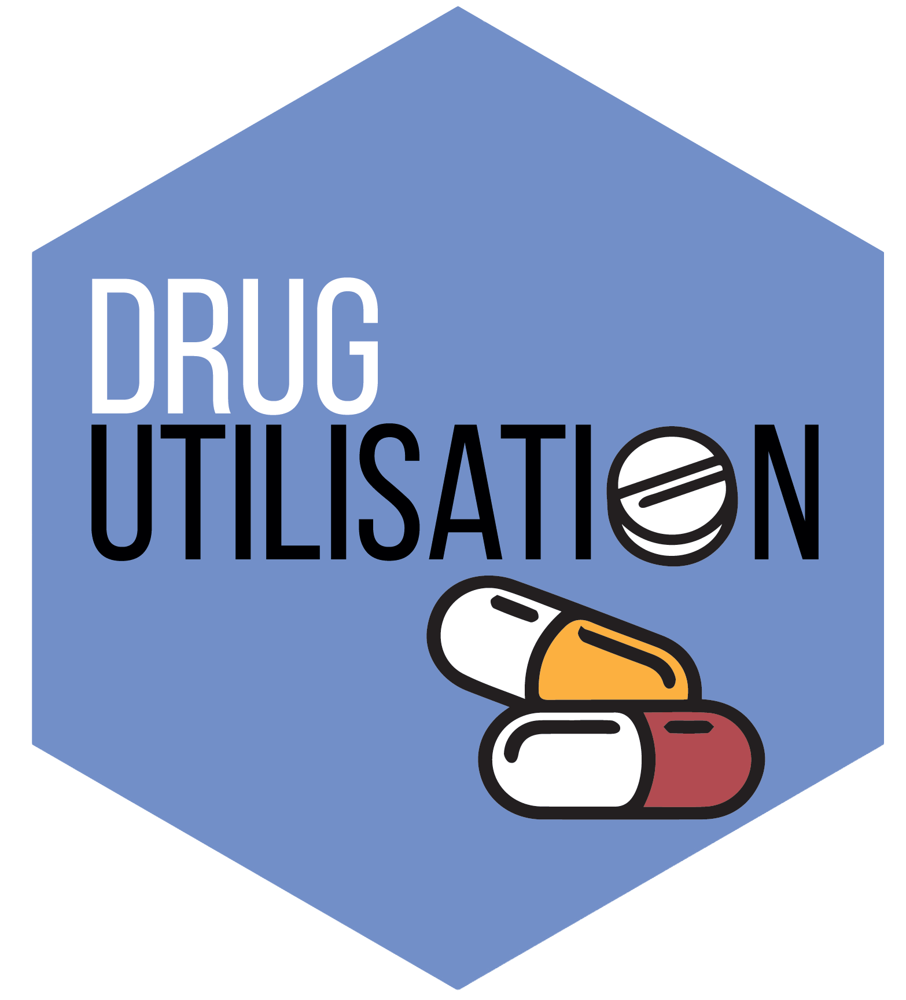

<!-- README.md is generated from README.Rmd. Please edit that file -->

# DrugUtilisation 

[](https://CRAN.R-project.org/package=DrugUtilisation)
[](https://app.codecov.io/github/darwin-eu/DrugUtilisation?branch=main)
[](https://github.com/darwin-eu/DrugUtilisation/actions)
[](https://lifecycle.r-lib.org/articles/stages.html)

## Package overview

DrugUtilisation contains functions to instantiate and characterise drug
cohorts in data mapped to the OMOP Common Data Model. The package
supports:

- Creation of drug cohorts

- Identification of indications for those in a drug cohort

- Summarising drug utilisation among a cohort in terms of duration,
  quantity, and dose

- Description of treatment adherence based on proportion of patients
  covered

- Detailing treatment restart and switching after an initial treatment
  discontinuation

## Example usage

First, we need to create a cdm reference for the data we´ll be using.
Here we generate an example with simulated data, but to see how you
would set this up for your database please consult the CDMConnector
package [connection
examples](https://darwin-eu.github.io/CDMConnector/articles/a04_DBI_connection_examples.html).

``` r
library(DrugUtilisation)
library(CDMConnector)
library(omopgenerics)
library(dplyr)

cdm <- mockDrugUtilisation(numberIndividual = 100)
```

### Create a cohort of acetaminophen users

To generate the cohort of acetaminophen users we will use
`generateIngredientCohortSet`, concatenating any records with fewer than
7 days between them. We then filter our cohort records to only include
the first record per person and require that they have at least 30 days
observation in the database prior to their drug start date.

``` r
cdm <- generateIngredientCohortSet(
  cdm = cdm,
  name = "dus_cohort",
  ingredient = "acetaminophen", 
  gapEra = 7
)
cdm$dus_cohort |> 
  requireIsFirstDrugEntry() |> 
  requireObservationBeforeDrug(days = 30)
#> # Source:   table<main.dus_cohort> [?? x 4]
#> # Database: DuckDB v0.10.0 [martics@Windows 10 x64:R 4.2.1/:memory:]
#>    cohort_definition_id subject_id cohort_start_date cohort_end_date
#>                   <int>      <int> <date>            <date>         
#>  1                    1          2 2016-04-20        2016-04-25     
#>  2                    1         42 2016-01-25        2017-01-25     
#>  3                    1         50 2012-09-06        2014-04-27     
#>  4                    1         59 2020-04-16        2020-05-08     
#>  5                    1         64 2022-04-16        2022-07-03     
#>  6                    1         71 2013-10-27        2014-04-03     
#>  7                    1         75 2002-04-30        2004-08-27     
#>  8                    1         82 2013-01-30        2013-02-19     
#>  9                    1         29 1997-06-07        1998-07-16     
#> 10                    1         68 2012-12-25        2013-05-01     
#> # ℹ more rows
```

### Indications of acetaminophen users

Now we´ve created our cohort we could first summarise the indications of
the cohort. These indications will always be cohorts, so we first need
to create them. Here we create two indication cohorts, one for headache
and the other for influenza.

``` r
indications <- list(headache = 378253, influenza = 4266367)
cdm <- generateConceptCohortSet(cdm, 
                                conceptSet = indications, 
                                name = "indications_cohort")
```

We can summarise the indication results using the `summariseIndication`
function:

``` r
indication_summary <- cdm$dus_cohort |> 
  summariseIndication(indicationCohortName = "indications_cohort", 
                      unknownIndicationTable = "condition_occurrence",
                      indicationWindow = list(c(-30, 0)))
#> Warning: Your SQL query is over 10,000 characters which can cause issues on some database platforms!
#> Try calling computeQuery earlier in your pipeline.
indication_summary |> glimpse()
#> Rows: 12
#> Columns: 13
#> $ result_id        <int> 1, 1, 1, 1, 1, 1, 1, 1, 1, 1, 1, 1
#> $ cdm_name         <chr> "DUS MOCK", "DUS MOCK", "DUS MOCK", "DUS MOCK", "DUS …
#> $ group_name       <chr> "cohort_name", "cohort_name", "cohort_name", "cohort_…
#> $ group_level      <chr> "161_acetaminophen", "161_acetaminophen", "161_acetam…
#> $ strata_name      <chr> "overall", "overall", "overall", "overall", "overall"…
#> $ strata_level     <chr> "overall", "overall", "overall", "overall", "overall"…
#> $ variable_name    <chr> "number records", "number subjects", "Indication from…
#> $ variable_level   <chr> NA, NA, "headache", "headache", "influenza", "influen…
#> $ estimate_name    <chr> "count", "count", "count", "percentage", "count", "pe…
#> $ estimate_type    <chr> "integer", "integer", "integer", "percentage", "integ…
#> $ estimate_value   <chr> "54", "54", "0", "0", "0", "0", "0", "0", "1", "1.851…
#> $ additional_name  <chr> "overall", "overall", "overall", "overall", "overall"…
#> $ additional_level <chr> "overall", "overall", "overall", "overall", "overall"…
```

### Drug use

We can quickly obtain a summary of drug utilisation among our cohort,
with various measures calculated for a provided ingredient concept (in
this case the concept for acetaminophen).

``` r
drug_utilisation_summary <- cdm$dus_cohort |> 
  summariseDrugUtilisation(ingredientConceptId = 1125315, 
                           gapEra = 7)
#> Warning: Your SQL query is over 10,000 characters which can cause issues on some database platforms!
#> Try calling computeQuery earlier in your pipeline.
drug_utilisation_summary |> glimpse()
#> Rows: 58
#> Columns: 13
#> $ result_id        <int> 1, 1, 1, 1, 1, 1, 1, 1, 1, 1, 1, 1, 1, 1, 1, 1, 1, 1,…
#> $ cdm_name         <chr> "DUS MOCK", "DUS MOCK", "DUS MOCK", "DUS MOCK", "DUS …
#> $ group_name       <chr> "cohort_name", "cohort_name", "cohort_name", "cohort_…
#> $ group_level      <chr> "161_acetaminophen", "161_acetaminophen", "161_acetam…
#> $ strata_name      <chr> "overall", "overall", "overall", "overall", "overall"…
#> $ strata_level     <chr> "overall", "overall", "overall", "overall", "overall"…
#> $ variable_name    <chr> "number records", "number subjects", "number exposure…
#> $ variable_level   <chr> NA, NA, NA, NA, NA, NA, NA, NA, NA, NA, NA, NA, NA, N…
#> $ estimate_name    <chr> "count", "count", "q25", "median", "q75", "mean", "sd…
#> $ estimate_type    <chr> "integer", "integer", "integer", "integer", "integer"…
#> $ estimate_value   <chr> "54", "54", "1", "1", "1", "1.27777777777778", "0.626…
#> $ additional_name  <chr> "overall", "overall", "concept_set", "concept_set", "…
#> $ additional_level <chr> "overall", "overall", "ingredient_1125315_descendants…
table(drug_utilisation_summary$variable_name)
#> 
#>     cumulative dose cumulative quantity        exposed time  initial daily dose 
#>                   7                   7                   7                   7 
#>    initial quantity         number eras    number exposures      number records 
#>                   7                   7                   7                   1 
#>     number subjects    time to exposure 
#>                   1                   7
```

### Combine and share results

Now we can combine our results and suppress any counts less than 5 so
that they are ready to be shared.

``` r
results <- bind(indication_summary,
                   drug_utilisation_summary) |> 
  suppress(minCellCount = 5)
results |> glimpse()
#> Rows: 70
#> Columns: 13
#> $ result_id        <int> 1, 1, 1, 1, 1, 1, 1, 1, 1, 1, 1, 1, 2, 2, 2, 2, 2, 2,…
#> $ cdm_name         <chr> "DUS MOCK", "DUS MOCK", "DUS MOCK", "DUS MOCK", "DUS …
#> $ group_name       <chr> "cohort_name", "cohort_name", "cohort_name", "cohort_…
#> $ group_level      <chr> "161_acetaminophen", "161_acetaminophen", "161_acetam…
#> $ strata_name      <chr> "overall", "overall", "overall", "overall", "overall"…
#> $ strata_level     <chr> "overall", "overall", "overall", "overall", "overall"…
#> $ variable_name    <chr> "number records", "number subjects", "Indication from…
#> $ variable_level   <chr> NA, NA, "headache", "headache", "influenza", "influen…
#> $ estimate_name    <chr> "count", "count", "count", "percentage", "count", "pe…
#> $ estimate_type    <chr> "integer", "integer", "integer", "percentage", "integ…
#> $ estimate_value   <chr> "54", "54", "0", "0", "0", "0", "0", "0", NA, NA, "53…
#> $ additional_name  <chr> "overall", "overall", "overall", "overall", "overall"…
#> $ additional_level <chr> "overall", "overall", "overall", "overall", "overall"…
```

## Further analyses

There are many more drug-related analyses that we could have done with
this acetaminophen cohort using the DrugUtilisation package. Please see
the package website for more details.
